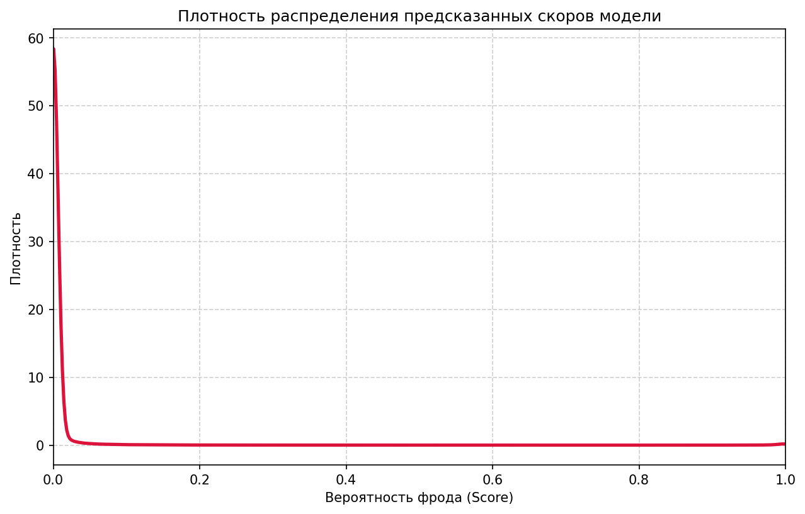

# ML Fraud Detection Service

Датасеты предоставлены в рамках соревнования https://www.kaggle.com/competitions/teta-ml-1-2025

Сервис для автоматического обнаружения мошеннических транзакций в режиме батчевого скоринга. Обрабатывает CSV-файлы из указанной директории с использованием предобученной CatBoost модели. 

## Архитектура решения
```
├── .gitignore
├── Dockerfile
├── README.md
├── app/
│ └── app.py # Ядро сервиса с обработчиком файлов
├── models/
│ └── my_catboost.cbm # Сериализованная модель CatBoost
│ └── preprocessing_artifacts.pkl # Артефакты предобработки данных
├── src/
│ ├── preprocessing.py # Пайплайн обработки данных
│ └── scorer.py # Модуль прогнозирования
└── input/ # Директория для загрузки файлов на скоринг
└── output/ # Директория с результатами скоринга
```

## Ключевые особенности

### Многоуровневое логирование
- Регистрация всех событий в файл `/app/logs/service.log`
- Консольный вывод для мониторинга в реальном времени
- 3 уровня детализации:
  - `INFO`: Основные этапы обработки
  - `DEBUG`: Детали преобразования данных
  - `ERROR`: Критические сбои с трейсбэками

### Пайплайн обработки данных (`preprocessing.py`)

1. **На этапе обучения:** Рассчитан глобальный средний таргет, построена база средних чеков для каждого `client_id` и вычислен **сглаженный Target Encoding (m-estimate)** для высококардинальных категорий (`merch`, `jobs`, `one_city`). Все маппинги сохранены в файл артефактов `preprocessing_artifacts.pkl`.

2. **На этапе инференса:** Функция `run_preproc` считывает входящий `test.csv`, извлекает компоненты времени (`hour`, `day_of_week`, `day_of_month`), формирует поведенческий признак (отношение текущей суммы к историческому среднему чеку клиента) и кодирует категории по словарям артефактов за константное время $O(1)$. Порядок признаков на выходе жестко зафиксирован для корректной работы модели.

### Модельный слой (`scorer.py`)
- Порог классификации: 0.88
- Автоматическая загрузка модели при инициализации
- Батчевая обработка через `predict_proba`

## Быстрый старт

### Требования
- Docker 20.10+
- 2 ГБ свободного места
- Порты: только файловая система

### Запуск сервиса

1. На Windows запустите docker desktop

2. Запустите контейнер с монтированием томов

```bash
docker compose up --build
```

3. После запуска сервиса (появления в логах сообщения: `__main__ - INFO - File observer started`) можно приступать к скорингу данных:

 - Разместите файл формата test.csv из соревнования https://www.kaggle.com/competitions/teta-ml-1-2025 в директории `./input`
 - Подождите выполнения препроцессинга и скоринга датасета (в логах будет указано название сформированного файла)
 - Полученный результат моделирования будет выгружен сервисом в директорию `./output`
 - Также в директории `./output` будет выгружен json-файл с топ-5 feature importances используемой модели и png-файл с графиком плотности распределения предсказанных моделью скоров по загруженному датасету


### Данные и модель

В сервисе использована модель, которая обучена на данных train.csv из соревнования https://www.kaggle.com/competitions/teta-ml-1-2025

Результат Submission в совревновании

Private Score 0.864693

Public score: 0.862395

### Разведочный анализ данных (EDA)

Анализ исходного датасета объемом **786 431 строк** выявил следующие ключевые особенности:
* **Критический дисбаланс классов:** Доля фрода составляет всего **0.573%** (4504 операции). Стандартный порог классификации (0.5) неприменим, требуется кастомная настройка порога (`MODEL_TH = 0.88`) под оптимизацию метрики F1-score.
* **Отсутствие пропусков:** В данных нет пропущенных значений, что позволило исключить этап импутации и ускорить инференс.
* **Идентификация клиентов:** Комбинация признаков `(lat, lon, gender, city, state)` уникально определяет профиль конкретного клиента (всего 962 уникальных профиля, ~817 транзакций на одного пользователя).
* **Аномалии в суммах:** Средний чек легитимной транзакции составляет **$67**, в то время как фродовой — **$529**. При этом мошеннические транзакции имеют жесткий верхний лимит в **$1334**.
* **Временные паттерны:** Вероятность фрода возрастает в 5 раз в ночные часы (22:00 и 23:00) — до **2.77%**.
* **Географическая избыточность:** Распределения расстояний между клиентом и продавцом для честных и фродовых транзакций абсолютно идентичны (медиана ~78 км). Прямой зависимости «дальше — значит фрод» нет, поэтому расчет расстояния был исключен из финального препроцессинга для экономии ресурсов CPU.

---

### Подготовка данных и Препроцессинг

Для обеспечения стабильного инференса на CPU без утечки данных (Data Leakage) и без использования тяжелого файла `train.csv` внутри контейнера, пайплайн разделен на два этапа:
1. **На этапе обучения:** Рассчитан глобальный средний таргет, построена база средних чеков для каждого `client_id` и вычислен **сглаженный Target Encoding (m-estimate)** для высококардинальных категорий (`merch`, `jobs`, `one_city`). Все маппинги сохранены в файл артефактов `preprocessing_artifacts.pkl`.
2. **На этапе инференса:** Функция `run_preproc` считывает входящий `test.csv`, извлекает компоненты времени (`hour`, `day_of_week`, `day_of_month`), формирует поведенческий признак (отношение текущей суммы к историческому среднему чеку клиента) и кодирует категории по словарям артефактов за константное время $O(1)$. Порядок признаков на выходе жестко зафиксирован для корректной работы модели.

---

### Топ-5 важных признаков (Feature Importances)

Модель **CatBoostClassifier** при принятии решений опирается на следующие ключевые маркеры (данные извлечены автоматически в `top_5_features.json`):

1. **`cat_id_encoded` (36.72%)** — Сглаженный рейтинг опасности категории товара. Модель выучила, в каких категориях (электроника, ювелирные изделия) чаще всего происходит фрод.
2. **`amount` (26.91%)** — Абсолютная сумма транзакции. Мошенники целятся в крупный чек.
3. **`one_city_encoded` (10.79%)** — Географический рейтинг фрод-активности городов.
4. **`hour` (6.81%)** — Час совершения операции. Позволяет модели детектировать аномальный ночной фрод.
5. **`amount_to_mean_ratio` (4.27%)** — Сгенерированный поведенческий признак. Отношение текущей суммы к среднему чеку клиента. Резкое превышение привычного лимита трат является главным триггером для модели.

### 📈 Распределение предсказанных скоров

После обработки тестового файла сервис автоматически генерирует график плотности распределения вероятностей фрода:



